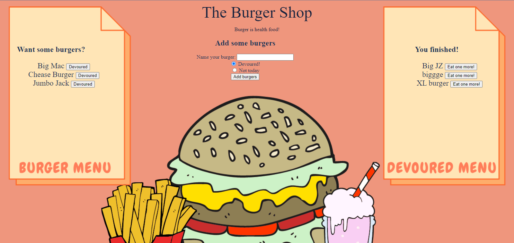

# Burger

## Heroku URL
https://burger-jz.herokuapp.com/

## Description
This is a restaurant app that lets users input the names of burgers they'd like to eat. Build with MySQL, Node, Express, Handlebars and a homemade ORM followed the MVC design pattern. Use Node and MySQL to query and route data in the app, and Handlebars to generate the HTML.

## Function
* Whenever a user submits a burger's name, The app will display the burger on the left side of the page -- waiting to be devoured.
* Each burger in the waiting area also has a `Devour it!` button. When the user clicks it, the burger will move to the right side of the page.
* Each burger in right side of the page also has a `Eat one more!` button. When the user clicks it, the burger will move back to the left side of the page.

## Img

